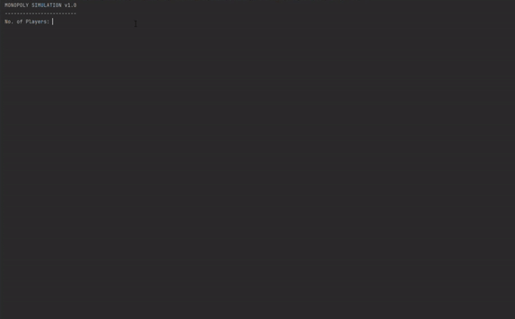

# Monopoly: Kanto Edition 

A simple multiplayer Monopoly simulator built in Python, all in the context of the Kanto region in Pokemon  
  
Developed in practice of Object-Oriented Programming and Circular Linked Lists

### Requirements 
    • Python 3.9  
    • random, time and re modules

## How to play?
Roll the dice and travel to different places in the Kanto region!  
Make your opponents pay rent if they go to the places you own and make them bankrupt  
The last player standing wins the game!

## Simple step-by-step tutorial

1. Run *maingame.py*  
1. Input number of users
3. Input player names
4. Roll the dice by pressing ENTER when its your turn
5. If a place is for sale, an option will appear to buy it. Input Y to do so.
5. Bankrupt other players and **WIN THE GAME!**

## License

